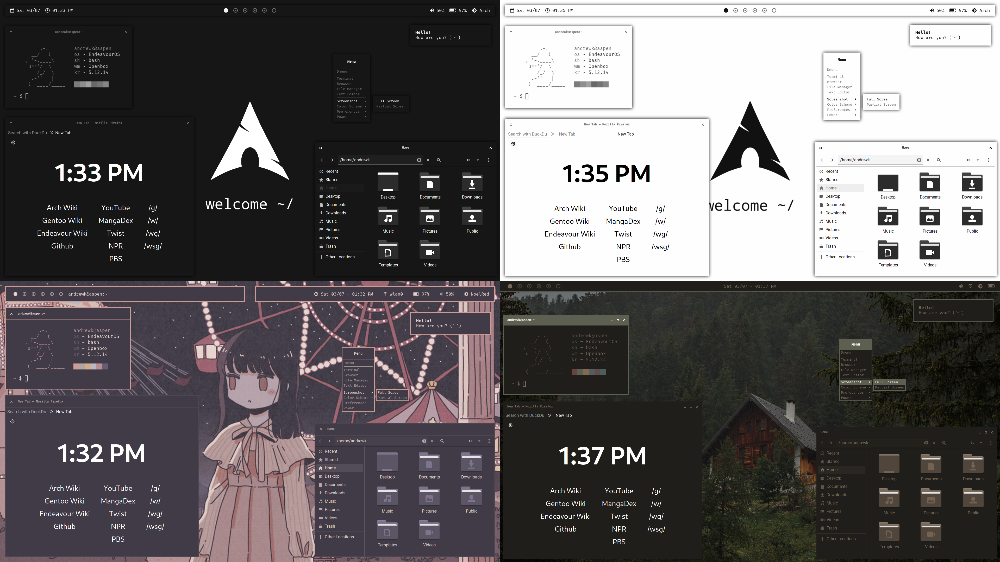
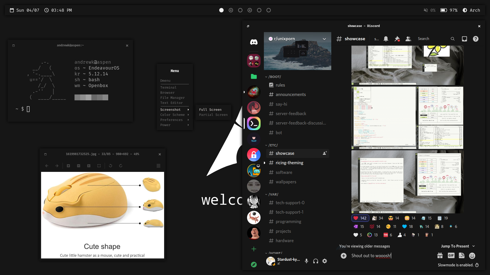
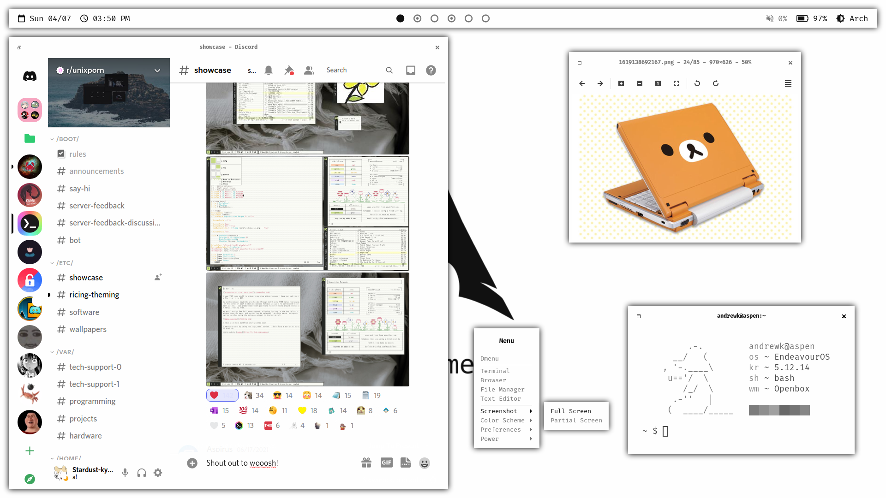
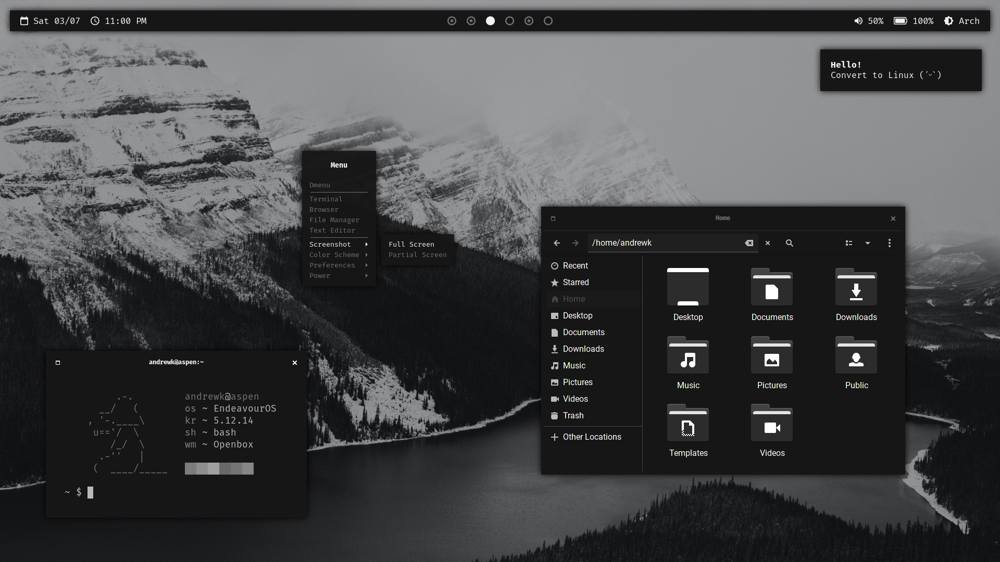
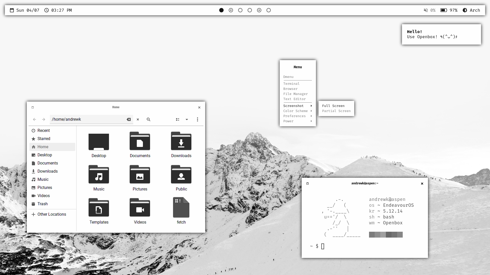
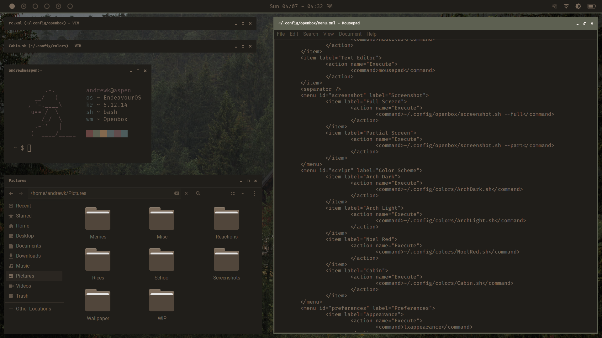
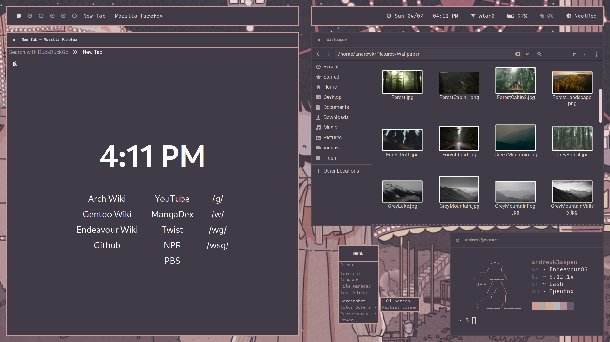

# Hello! Thank you for checking out my dotfiles.

## **DISCLAIMER: THIS REPO IS NOT COMPLETE. CONTACT ME IF YOU HAVE ISSUES.**

## Overview

These files work together to achieve a unified desktop that can be changed on the fly. **Changing and/or removing these files may break it. Make sure you know what you're doing before messing with them.**

This project aims to provide several cohesive desktops that can be changed on the fly and used seamlessly across window managers. It also aims to be easy to create new desktops, although it currently is not in a state where tools exist to create them. It is not meant to be an easy way to change your desktop's color scheme quickly; you will need to create a file for a new desktop and specify what you want it to do.

## Pictures



| Arch Dark				| Arch Light				|
| :---:					| :---:					|
| 		| 		|
| Arch Dark Alt				| Arch Light Alt			|
| 	| 	|
| Cabin					| Noel Red				|
| 		| 	|

##  FAQ

> Isn't this like [Archcraft](https://archcraft.io/)?

Yes! I started this project in December of 2020, but didn't know about Archcraft until about I was about half a year in. This project is incredibly similar to Archcraft, even using the same methods to achieve a similar goal, with one key difference: this project has the *same* desktops, even across window managers. Archcraft has seperate configurations and desktops for its window managers. That being said, I recommend Archcraft to anyone looking for a more polished experience than what this project currently provides.

> Isn't this like [Flavours](https://github.com/Misterio77/flavours)?

No. The purpose of Flavours is to quickly and easily change your *existing desktop's* color scheme. The purpose of this project is to change your *desktop* with existing configurations- that means changing your bar, gtk theme, window decorations, and more to something preset.

> What are your plans for this?

My current plans for this project are to create a few more desktops, make an installation script to make it easier for anyone to use, create some tools to make creating a new desktop easier, and eventually turn it into its own distrobution. It's unlikely that any of these will be accomplished in the near future, but there will be a new update once at least a few of these are completed.

## Installation

On Arch, you will need the following packages. There may be some that are missing.

From official repos:
```
alacritty rxvt-unicode bspwm sxhkd i3-gaps obconf dunst picom polybar xsettingsd lightdm-webkit2-greeter firefox nitrogen nautilus mousepad vim maim polkit-gnome network-manager-applet blueberry lxappearance xorg-xbacklight ttf-fira-code ttf-roboto
```

From the AUR:
```
betterlockscreen discord-canary zentile nerd-fonts-fira-code nerd-fonts-iosevka
```

From source:
```
[openbox](https://github.com/Stardust-kyun/openbox) [dmenu](https://github.com/Stardust-kyun/dmenu) [powercord](https://powercord.dev/installation)
```

There currently isn't an installation script for my dotfiles, so follow this:

- Files in the `home` directory should go in your user's home directory.
- Files in the `bin` directory should go in either `/bin` or `/usr/bin`.
- Files in the `usr/share` directory should go in `/usr/share`.
- You will need to substitute `home/.mozilla/firefox/default-release` with your default release directory. These are usually follow `xxxxxxxx.default-release` as their naming scheme.
- You may need to substitute in your own files in some cases, like `home/.config/eww/image.png`.
- Clone powercord into `~/.config`. It will not work otherwise.
- For openbox, read `README.GIT` for instructions on how to install.
- After copying `usr/share/icons`, run `tar -xzvf filename.tar.gz` to extract.

If you have any issues, feel free to contact me. You can reach out to me on discord: @Stardust-kyun#5994.

## Quick Start

If this is your first time using my dotfiles, I would recommend starting by using `Alt+k` to bring up the keybindings menu. This will display most if not all of the keybindings used, as well as keybindings specific to certain window managers. If you're using Openbox, you can also use the right click menu to launch some applications instead of Dmenu.
